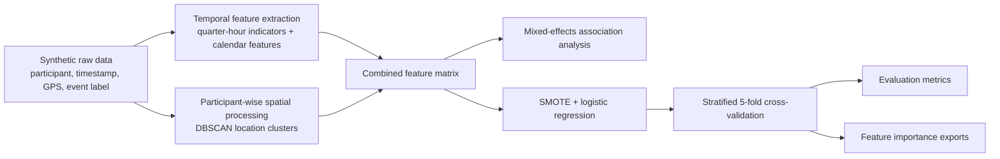

<div align="center">

# PhysiAware

### Temporal and spatial feature analysis for predicting smoking events

[](https://www.nature.com/articles/s41746-025-01799-5)
[](https://doi.org/10.1038/s41746-025-01799-5)
[](https://pubmed.ncbi.nlm.nih.gov/40615665/)
[](https://www.python.org/)
[](https://jupyter.org/)

**Code, synthetic data, and a reproducible analysis example supporting the paper  
“Relative importance of temporal and location features in predicting smoking events.”**

[Read the paper](https://www.nature.com/articles/s41746-025-01799-5) ·
[Explore the notebook](data_processing_modeling.py.ipynb) ·
[View synthetic data](synthetic_raw_data.csv) ·
[Report an issue](https://github.com/UMN-RXInformatics/PhysiAware/issues)

</div>

---

## Overview

PhysiAware is a research code repository accompanying the open-access article:

> **Yang H, Yu H, Kotlyar M, Dufresne SR, Pakhomov SVS.**  
> *Relative importance of temporal and location features in predicting smoking events.*  
> **npj Digital Medicine.** 2025;8:409.  
> https://doi.org/10.1038/s41746-025-01799-5

The study examined whether passively available **temporal features** or **smartphone-derived spatial features** contribute more to the prediction of smoking events. Across the modeling configurations evaluated in the paper, removing temporal features produced a substantial decline in performance, whereas removing location features had only a small effect.[^1]

Because the original participant-level data contain sensitive behavioral and geolocation information, they are not distributed in this repository. Instead, the repository provides:

- a synthetic dataset with the columns and structure needed to demonstrate the workflow;
- a deterministic synthetic-data generator;
- reusable temporal and spatial feature-processing functions;
- an end-to-end Jupyter notebook for preprocessing, association analysis, model fitting, cross-validation, and result export; and
- example output files generated from the synthetic data.

> [!IMPORTANT]
> The synthetic dataset is intended to demonstrate **code execution and analysis structure**. It does **not** reproduce the study population, the original observations, or the numerical results reported in the paper.
> Due to the data privacy limit, we could not directly share our raw data in our study. So we create a synthetic datatable named `synthetic_raw_data.csv`, including all the necessary columns and other structure needed for our methods implementation. The script of generating this data file is named `Synthetic_data_Generate.py`. We showed the detailed sample usage of our processing data, doing correlation analysis, building logistic regression, and saving model results within the jupyter notebook `data_processing_modeling.ipynb`.

---

## Paper at a glance

| Study component         | Description                                                  |
| ----------------------- | ------------------------------------------------------------ |
| Participants            | 38 participants                                              |
| Reported smoking events | 1,784 events collected during up to two weeks of ad-libitum smoking |
| Temporal information    | Time-window indicators, time of day, day of week, weekend status, and seasonality |
| Spatial representations | DBSCAN, K-means, and distance from initial geolocation       |
| Predictive models       | Logistic regression, random forest, and multilayer perceptron |
| Evaluation windows      | Half-time intervals from 5 to 30 minutes                     |
| Main result             | Excluding temporal features consistently reduced predictive performance; excluding location features produced comparatively minor changes |
| Best reported result    | Random forest with DBSCAN and a 20-minute half-time interval reached a Macro-F1 score of 87.98% |
| Practical implication   | Temporal cues may support simpler, more privacy-preserving just-in-time smoking-cessation interventions |

All study-level values above are reported in the accompanying article.[^1]

---

## What is implemented here?

The published paper evaluates a broader collection of model families and spatial representations. The public notebook focuses on a transparent, executable example of the analysis pipeline.

| Component                                           | Published study | Public repository example |
| --------------------------------------------------- | --------------: | ------------------------: |
| Temporal feature extraction                         |               ✅ |                         ✅ |
| DBSCAN location clustering                          |               ✅ |                         ✅ |
| K-means and distance-from-initial-location analyses |               ✅ |                         — |
| Mixed-effects association analysis                  |               ✅ |                         ✅ |
| Logistic regression                                 |               ✅ |                         ✅ |
| Random forest and multilayer perceptron             |               ✅ |                         — |
| Participant-level stratified cross-validation       |               ✅ |                         ✅ |
| Synthetic demonstration data                        |               — |                         ✅ |
| Original participant data                           |      Restricted |              Not included |

---

## Repository structure

```text
PhysiAware/
├── README.md
├── Synthetic_data_Generate.py
├── synthetic_raw_data.csv
├── functions.py
├── data_processing_modeling.py.ipynb
└── synthetic_data_5-fold_CV/
    ├── synthetic_data_Evaluation_metrics_logistic_regression_15_min.xlsx
    ├── synthetic_data_feature_importances_all_logistic_regression_15_min.xlsx
    ├── synthetic_data_feature_importances_wo_location_logistic_regression_15_min.xlsx
    └── synthetic_data_feature_importances_wo_time_logistic_regression_15_min.xlsx
```

### File guide

| File                                | Purpose                                                      |
| ----------------------------------- | ------------------------------------------------------------ |
| `Synthetic_data_Generate.py`        | Generates a seeded synthetic dataset and writes `synthetic_raw_data.csv` |
| `synthetic_raw_data.csv`            | Synthetic tabular data used by the demonstration notebook    |
| `functions.py`                      | Helper functions for temporal encoding, participant-wise DBSCAN clustering, preprocessing, and statistical utilities |
| `data_processing_modeling.py.ipynb` | End-to-end example covering preprocessing, mixed-effects analysis, logistic regression, SMOTE, stratified 5-fold cross-validation, and result export |
| `synthetic_data_5-fold_CV/`         | Example evaluation metrics and feature-importance workbooks produced from synthetic data |

---

## Analysis workflow



---

## Quick start

### 1. Clone the repository

```bash
git clone https://github.com/UMN-RXInformatics/PhysiAware.git
cd PhysiAware
```

### 2. Create an environment

The notebook metadata records Python 3.8.8. A Python 3.8+ environment is recommended for compatibility with the original notebook.

```bash
python -m venv .venv
source .venv/bin/activate
```

On Windows PowerShell:

```powershell
python -m venv .venv
.venv\Scripts\Activate.ps1
```

### 3. Install dependencies

```bash
python -m pip install --upgrade pip

pip install \
  jupyter \
  pandas \
  numpy \
  scipy \
  tqdm \
  scikit-learn \
  imbalanced-learn \
  statsmodels \
  openpyxl
```

### 4. Use the included synthetic data

The repository already includes `synthetic_raw_data.csv`, so you can immediately launch the notebook:

```bash
jupyter lab data_processing_modeling.py.ipynb
```

Run the cells in order.

### 5. Optionally regenerate the synthetic data

```bash
python Synthetic_data_Generate.py
```

The generator uses fixed random seeds for repeatability and writes its output to:

```text
./synthetic_raw_data.csv
```

> [!CAUTION]
> Running the generator overwrites the existing `synthetic_raw_data.csv` file.

---

## Synthetic data schema

| Column           | Description                                                  |
| ---------------- | ------------------------------------------------------------ |
| `person_id`      | Synthetic participant identifier                             |
| `timestamp`      | Unix timestamp                                               |
| `longitude`      | Synthetic longitude                                          |
| `latitude`       | Synthetic latitude                                           |
| `substance`      | Synthetic smoking-event indicator represented through missing/non-missing substance entries |
| `is_after_covid` | Indicator based on whether the timestamp occurs after May 11, 2023 |

The generator targets 50,000 rows and creates up to 50 synthetic participant identifiers. These settings describe the **demonstration dataset**, not the sample used in the published study.

---

## Feature engineering

### Temporal features

The repository derives:

- 96 quarter-hour indicators spanning a 24-hour period;
- day of the week;
- weekday versus weekend status; and
- season of the year.

A configurable half-duration is applied around each event timestamp. In the current helper module, the default is 15 minutes on either side of the timestamp.

### Spatial features

Location coordinates are clustered separately for each synthetic participant using **DBSCAN**. Participant-specific cluster names are created to prevent cluster labels from being interpreted as shared locations across participants.

### Modeling example

The notebook demonstrates:

- binary event-label construction;
- participant-level analysis;
- class balancing with SMOTE;
- logistic regression with balanced class weights;
- stratified 5-fold cross-validation;
- confusion-matrix, Macro-F1, ROC-AUC, accuracy, and balanced-accuracy calculation; and
- comparison of all features, location-excluded features, and time-excluded features.

---

## Interpreting the demonstration

The repository is designed to show how the analysis code is organized—not to regenerate the paper's reported estimates from public data.

You should expect the following differences:

1. **Synthetic behavior is not real behavior.** Generated timestamps, coordinates, and event labels do not preserve the behavioral relationships in the restricted study dataset.
2. **Notebook outputs are illustrative.** Metrics and coefficients produced from `synthetic_raw_data.csv` should not be compared directly with the published tables.
3. **Some statistical fits may be unstable.** Synthetic participant subsets can lack sufficient outcome or location-cluster variation for particular mixed-effects models.
4. **The repository demonstrates a subset of the paper's experiments.** The paper additionally reports random-forest, multilayer-perceptron, K-means, and distance-from-initial-location analyses.

For scientific conclusions, refer to the peer-reviewed article.[^1]

---

## Data privacy and responsible use

The original data are not publicly shared because they include sensitive longitudinal behavioral and geolocation information. The synthetic data in this repository are not participant records and should not be treated as clinical or epidemiological evidence.

This code is provided for research transparency and methodological illustration. It is not a medical device and is not intended for clinical decision-making or individual smoking-risk assessment.

---

## Citation

Please cite the paper when using this repository, its workflow, or its accompanying research findings. Thank you! 😊

### APA

```text
Yang, H., Yu, H., Kotlyar, M., Dufresne, S. R., & Pakhomov, S. V. S. (2025).
Relative importance of temporal and location features in predicting smoking events.
npj Digital Medicine, 8, 409.
https://doi.org/10.1038/s41746-025-01799-5
```

### BibTeX

```bibtex
@article{yang2025relative,
  author  = {Yang, Han and Yu, Hang and Kotlyar, Michael and
             Dufresne, Sheena R. and Pakhomov, Serguei V. S.},
  title   = {Relative importance of temporal and location features
             in predicting smoking events},
  journal = {npj Digital Medicine},
  year    = {2025},
  volume  = {8},
  number  = {1},
  pages   = {409},
  doi     = {10.1038/s41746-025-01799-5},
  url     = {https://doi.org/10.1038/s41746-025-01799-5}
}
```

Additional identifiers:

- **DOI:** [`10.1038/s41746-025-01799-5`](https://doi.org/10.1038/s41746-025-01799-5)
- **PMID:** [`40615665`](https://pubmed.ncbi.nlm.nih.gov/40615665/)
- **PMCID:** [`PMC12227676`](https://pmc.ncbi.nlm.nih.gov/articles/PMC12227676/)

---

## Contributing and questions

Questions, bug reports, and reproducibility notes are welcome through [GitHub Issues](https://github.com/UMN-RXInformatics/PhysiAware/issues).

For research-related questions, contact **yang8597@umn.edu**.

When reporting an execution issue, please include:

- operating system;
- Python version;
- package versions;
- the notebook cell or script involved; and
- the complete error message.

---

<div align="center">


Developed at the **University of Minnesota**

[Paper](https://www.nature.com/articles/s41746-025-01799-5) ·
[DOI](https://doi.org/10.1038/s41746-025-01799-5) ·
[PubMed](https://pubmed.ncbi.nlm.nih.gov/40615665/) ·
[Repository](https://github.com/UMN-RXInformatics/PhysiAware)

</div>

[^1]: H. Yang, H. Yu, M. Kotlyar, S. R. Dufresne, and S. V. S. Pakhomov, “Relative importance of temporal and location features in predicting smoking events,” *npj Digital Medicine*, vol. 8, article 409, 2025. https://doi.org/10.1038/s41746-025-01799-5


